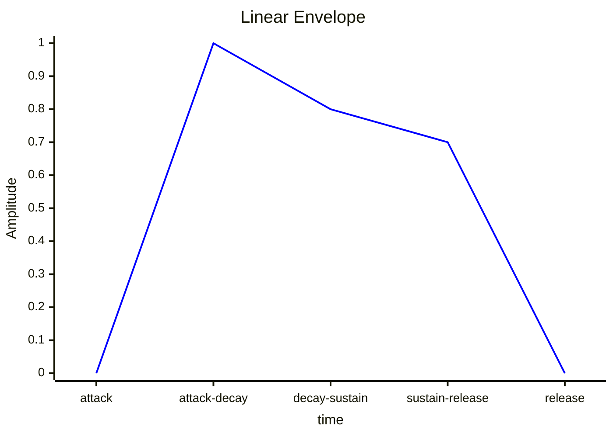

# Primitive engine 

Welcome to Primitive engine documentation!

Primitive engine is based on pygame_tools_tafh module, and is written on python as a wrapper for pygame module.

---

# Example

It is example of red circle object on the screen

```py
from engine_antiantilopa import *

# Create Engine with 700x500 window
e = Engine(Vector2d(700, 500))


# Bind keys for movement of camera (Default wasd)
bind_keys_for_camera_movement()

# Create Game object with Coords <0, 0> and surface 500x500
world = GameObject("world")
world.add_component(Transform(Vector2d(0, 0)))
world.add_component(SurfaceComponent(Vector2d(500, 500)))

# bind world to the root of gameobjects chain
GameObject.root.add_child(world)

# Create Game object with Coords <0, 0>, red color, and surface 500x500
button = GameObject("button")

button.add_component(CircleShapeComponent(100))
button.add_component(Transform(Vector2d(0, 0)))
button.add_component(ColorComponent((255, 0, 0)))
button.add_component(SurfaceComponent(Vector2d(500, 500)))

# bind button to world object
world.add_child(button)

#run engine
e.run()

```

---

# Relative links:
- [Engine](#engine)
- [Game Object](#game-object)
- [Component](#component)
- [Surface Component](#surface-component)
- [Color Component](#color-component)
- [Shape Component](#shape-component)
- [Circle Shape Component](#circle-shape-component)
- [Rect Shape Component](#rect-shape-component)
- [On Click Component](#on-click-component)
- [Key Bind Component](#key-bind-component)
- [Label Component](#label-component)
- [Sprite Component](#sprite-component)
- [Animation Component](#animation-component)
- [Animation Object](#animation-object)
- [Entry Component](#entry-component)
- [Sound Component](#sound-component)
- [Camera](#camera)
- [Vector Math](#vector-math)
- - [Vector2d](#vector2d)
- - [Angle](#angle)
- [Synthesizer](#synthesizer)
- - [Linear Envelope](#linear-envelope)
- - [Note](#note)
- - [Synths](#synths)
---

# Engine

main object of programm
> Engine() -> Engine
> Engine(window_size: Vector2d) -> Engine

- [init()](#engineinit)
- [draw()](#enginedraw)
- [first_iteration()](#enginefirst_iteration)
- [iteration()](#engineiteration)
- [run()](#enginerun)
- [update()](#engineupdate)
- [set_debug()](#engineset_debug)
- [forced_blit()](#engineforced_blit)
- [set_func_per_tick()](#engineset_func_per_tick)
<br>
The *Engine* class gathers and launches all code at once. Default init creates window size equal to size of display.

**Arguments:**
- window_size (Vector2d | tuple[int, int]) <br> size of created window.

**Returns:**
- newly created *Engine* object.

**Variables:**
- no parameters

**Static Variables:**
- funcs_per_tick (list\[Callable]) <br> list of functions that will be called every game tick.

### Engine.init()
Engine.init() -> None
Static method. Calls pygame initializations (pygame init, font init, mixer init, keyboard input init, and so on). Must be called before everything else

### Engine.first_iteration()
Engine.first_iteration() -> None
Calls [first_iteration()](#gameobjectfirst_iteration) method from all [game objects](#game-object).

### Engine.iteration()
Engine.iteration() -> None
Calls [iteration()](#gameobjectiteration) method from all [game objects](#game-object).

### Engine.draw()
Engine.draw() -> None
First, all surfaces that need to be cleared are cleared. The need is defined as whether one of oncomers need_blit is equal true, and it is in camera view, or game object need_draw is true. Then, calls [draw()](#gameobjectdraw) method from all game objects. After, it blits all surfaces, whose need_blit is True and is in camera view, according to oncoming preference. The way it works is that: child object is always higher than its parent. game objects that are not in camera view does not blit, so need_blit does not change.

### Engine.refresh()
Engine.update() -> None
Calls [refresh()](#compomemtrefresh) method from all component classes.

### Engine.run()
Engine.run(fps: float) -> None
runs pygame application with given frame rate in a loop until window quit or error occur. Before main loop, *first_iteration()* method is called. In the loop, the methods are called in the given order:
1. func() from *funcs_per_tick* static variable.
2. iteration()
3. draw()
4. refresh()
5. pygame.display.flip()

### Engine.set_debug()
Engine.set_debug(value: bool) -> None
Static method. Sets global DEBUG variable equal to value.

### Engine.forced_blit()
Engine.draw() -> None
calls iteration(), calls [draw()](#gameobjectdraw) from all game objects, then blits all surfaces, according to oncoming preference (as in draw()).

### Engine.set_func_per_tick()
Engine.set_func_per_tick(func: Callable) -> None
appends func to *funcs_per_tick* static variable.

---

# Game Object

object for all game "objects"
> GameObject() -> GameObject
> GameObject(tags: str) -> GameObject
> GameObject(tags: list\[str]) -> GameObject

- [get_group_by_tag()](#gameobjectget_group_by_tag)
- [get_game_object_by_tags()](#gameobjectget_game_object_by_tags)
- [add_component()](#gameobjectadd_component)
- [add_child()](#gameobjectadd_child)
- [get_component()](#gameobjectget_component)
- [contains_component()](#gameobjectcontains_component)
- [get_childs()](#gameobjectget_childs)
- [first_iteration()](#gameobjectfirst_iteration)
- [iteration()](#gameobjectiteration)
- [draw()](#gameobjectdraw)
- [enable()](#gameobjectenable)
- [disable()](#gameobjectdisable)
- [destroy()](#gameobjectdestroy)
- [show_geneology_tree()](#gameobjectshow_geneology_tree)
- [need_draw_set_true()](#gameobjectneed_draw_set_true)
- [need_blit_set_true()](#gameobjectneed_blit_set_true)
<br>

The *GameObject* class is a kind of container for [components](#component). It can be accessed by its tags. Default init creates empty GameObject without tags. For Gameobjects, [Transform](#transform) and [Surface](#surface-component) Components are necessary.

**Arguments:**
- tags (list\[str] | str) <br> tag or list of tags to identify game object 

**Returns:**
- newly created *GameObject* object.

**Variables:**
- tags (list\[str]) <br> all tags of the game objects.
- components (list[[Component](#component)]) <br> all components of the game object.
- childs (list[[GameObject](#game-object)]) <br> all game objects binded to the game object.
- parent ([GameObject](#game-object)) <br> a game object that the game object is binded to.
- active (bool) <br> state of the game object. If not active, it will not iterate or be drawn on screen.
- need_draw (bool) <br> flag variable. if true, game object will be drawn.
- need_blit (bool) <br> flag variable. if true and game object is on screen (absolute cordinates touches screen), game object will be blit.
- need_first_iteration (bool) <br> flag variable. if true, game object will call *first_iteration* instead of *iteration*.

**Static Variables:**
- root ([GameObject](#game-object)) <br> root game object representing screen. all gameobject have to be chained to it to be drawn. 
- objs (list\[[GameObject](#game-object)]) <br> all initialized game objects list. Initially empty `[]`
- group_tag_dict (dict\[str, [GameObject](#game-object)]) <br> dictionary of tags to game objects. Initially empty `{}`.

### GameObject.get_group_by_tag()
GameObject.get_group_by_tag(tag: str) -> list\[[GameObject](#game-object)]
Static method. returns all game objects with given tag. if there are no, empty list returned.

### GameObject.get_game_object_by_tags()
GameObject.get_game_object_by_tags(*tags: list\[str]) -> [GameObject](#game-object)
Static method. returns one game object that has the given tags only. if there are more than 1 or, there are no such, Exception raised.

### GameObject.show_geneology_tree()
show_geneology_tree(game_object: [GameObject](#game-object)|None = None, depth: int = 1) -> None
prints geneology tree starting from given game object. Default starting point is root game object.

### GameObject.add_component()
GameObject.add_component(component: [Component](#component)) -> None
adds given component to components list of the game object

### GameObject.add_child()
GameObject.add_child(child: [GameObject](#game-object)) -> None
binds given game object to the game object

### GameObject.get_component()
GameObject.get_component(component_type: type\[T]) -> T
returns component of a given type. If there is no such, Key error exception is raised
> [!Note]
> example: `game_object.get_component(Component) -> Component()`
> pass as an argument the type itself, and get its instance if it exists.

### GameObject.contains_component()
GameObject.contains_component(component_type: type\[T]) -> bool
checks if the game object has component of given type.
> [!Note]
> example: `game_object.get_component(Component) -> bool()`
> pass as an argument the type itself, and get result as boolean.

### GameObject.get_childs()
GameObject.get_childs(tag: str) -> list\[[GameObject](#game-object)]
returns all childs of the components with a given tag.

### GameObject.first_iteration()
GameObject.first_iteration() -> None
Calls [first_iteration()](#componentfirst_iteration) method for all components of the game object.

### GameObject.iteration()
GameObject.iteration() -> None
Calls [iteration()](#componentiteration) method for all components of the game object.

### GameObject.draw()
GameObject.draw() -> None
if need_draw and acive are both True, calls [draw()](#componentdraw) method for all components of the game object.

### GameObject.enable()
GameObject.enable() -> None
sets acrive variable equal to True and enables all game objects chained to this game object.

### GameObject.disable()
GameObject.disable() -> None
sets acrive variable equal to False and disables all game objects chained to this game object.

### GameObject.need_draw_set_true()
GameObject.need_draw_set_true() -> None
Sets need_draw equal to true, and if parent exists, calls *need_draw_set_true()* method for parent.

### GameObject.need_blit_set_true()
GameObject.need_blit_set_true() -> None
Sets need_blit equal to true, and if parent exists, calls *need_blit_set_true()* method for parent.

> [!WARNING]
> changing *need_draw* or *need_blit* manually, can cause unexpected errors.

### GameObject.destroy()
GameObject.destroy() -> None
destroys game object and all childs and components of the game object. Removes it from tag dictionary, objs list, and parents' childs list. Calls *need_blit_set_true()* and *need_draw_set_true()* functions.

---

# Component
base class for other components in game. Not used directly.
> Component() -> Component

- [fisrt_iteration()](#componentfirst_iteration)
- [iteration()](#componentiteration)
- [draw()](#componentdraw)
- [refresh()](#componentrefresh)
- [destroy()](#componentdestroy)
<br>

**Arguments:**
- no arguments

**Returns:**
- no returns

**Variables:**
- game_object ([GameObject](#game-object)) <br> game_object that contains the component

**Static Variables:**
- component_classes (list\[type\[Component]]) <br> list of all classes that inherited from Component

> [!WARNING]
> overwriten `__init_subclass__` in Component's child classes should call `Component.__init_subclass__`, or implement its work.

### Component.first_iteration()
Component.first_iteration() -> None
Virtual method. Will be called when the engine starts, or if game object *need_first_iteration* is True

### Component.iteration()
Component.iteration() -> None
Virtual method. Will be called every tick.

### Component.draw()
Component.draw() -> None
Virtual method. Will be called when game object *need_draw* is True

### Component.refresh()
Component.refresh() -> None
Static method. Virtual method. Will be called every tick

### Component.destroy()
Component.destroy() -> None
Virtual method. Will be called when game object that has this component is destroyed

---

# Transform
Child class of [Component](#component).
object for representing position and rotation in 2 dimensions.
> Transform() -> Transform
> Transform(pos: Vector2d) -> Transform
> Transform(rotation: Angle|float) -> Transform
> Transform(pos: Vector2d, rotation: Angle|float) -> Transform

- [first_iteration](#transformfirst_iteration)
- [move()](#transformmove)
- [rotate()](#transformrotate)
- [set_pos()](#transformset_pos)
- [set_rotation()](#transformset_rotation)
- [update_abs_pos()](#transformupdate_abs_pos)
- [refresh()](#transformrefresh)
<br>

**Arguments:**
- pos (Vector2d) <br> position of the **center** of the game object.
- rotation (Angle | float) <br> angle of the gameobject. ***Not working now!!!***

> [!WARNING]
> as it is stated above, angles and rotations are not fully implemented in the code. Using them is not safe, and can cause exceptions, or unpredictable behavior.

**Returns:**
- newly created *Transform* object.

**Variables:**
- pos (Vector2d) <br> position of the **center** of the game object relative to its parent's **center**.
- abs_pos (Vector2d) <br> position of **center** of the game object relative to main screen's **center**.
- rotation (Angle) <br> angle of the gameobject.
- changed (bool) <br> flag variable. Shows whether Trnasform has changed. Initially `False`

**Static Variables:**
- objs (list\[Transform]) <br> list of all Transform instances.

### Transform.first_iteration()
Transform.first_iteration() -> None
Finds abs_pos for all Transform instances.

### Transform.move()
Transform.move(delta: Vector2d) -> None
Changes *pos* with given delta, sets *changed* equal to True. Calls [need_blit_set_true()](#gameobjectneed_blit_set_true) for the game object. Calls *update_abs_pos()* for self.

### Transform.rotate()
Transform.rotate(delta: Angle) -> None
Changes *rotation* with given delta. **Not working now !!!**

### Transform.set_pos()
Transform.set_pos(pos: Vector2d) -> None
Sets *pos* equal to pos, sets *changed* equal to True. Calls [need_blit_set_true()](#gameobjectneed_blit_set_true) for the game object. Calls *update_abs_pos()* for self.

### Transform.set_rotation()
Transform.set_rotation(rotation: Angle) -> None
Sets *rotation* equal to given rotation. **Not working now !!!**

### Transform.update_abs_pos()
Transform.update_abs_pos(abs_pos: Vector2d) -> None
Sets *abs_pos* equal to given abs_pos + *pos*. Calls update_abs_pos(*abs_pos*) from all childs of the game object.

### Transform.refresh()
Transform.refresh() -> None
Static method. Sets *changed* equal to False for all instances of Transform.

---

# Surface Component
Child class of [Component](#component).
object for representing surface where everything is drawn.
> SurfaceComponent(size: Vector2d, crop: bool = True) -> SurfaceComponent

- [first_iteration()](#surfacecomponentfirst_iteration)
- [blit()](#surfacecomponentblit)
- [update_oncoming()](#surfacecomponentupdate_oncoming)
- [add_oncoming()](#surfacecomponentadd_oncoming)
- [remove_oncoming()](#surfacecomponentremove_oncoming)
- [destroy()](#surfacecomponentdestroy)
<br>

**Requirements:**
- [Transform Component](#transform)
- parent with Surface Component

**Arguments:**
- size (Vector2d) <br> size of surface and game object.
- crop (bool) <br> flag variable. shows whether or not the surface should be cropped by parent surface. Initially `True`.
- layer (int) <br> the layer of the surface. Initially `1`

> [!WARNING]
> layer variable should not be negative. if layer is negative, some functions may not work!

**Returns:**
- newly created *SurfaceComponent* object.

**Variables:**
- size: Vector2d <br> size of surface and game object.
- pg_surf: pygame.Surface <br> actual pygame surface where child game objects will be drawn
- crop (bool) <br> flag: whether or not the surface should be cropped by parent surface. When True, it is much easier for computer to run the game
- depth (int) <br> shows to which depth it needs to "fall". equal 1 if *crop*.
- oncoming (list\[[GameObject](#game-object)]) <br> list of game objects that will be blit on the surface
- layer (int) <br> the layer of the surface. higher the layer variable, higher the surface will be. 

> [!NOTE]
> the layer do not affect game objects that has different parent. If two objects with the same parent have the same layer variable, the overlay may be unpredictable! 

### SurfaceComponent.first_iteration()
SurfaceComponent.first_iteration() -> None
Tries to find where each surface should be blit. If *crop*, then it will blit on parent even if it is not fully inside it.

### SurfaceComponent.blit()
SurfaceComponent.blit() -> None
Blits the surface to parent surface. If game object is root, nothing happens. (because root has not parent game object). If someone under the surface changed its position ([Transform.changed](#transform)), calls *update_oncoming()*

### SurfaceComponent.update_oncoming()
SurfaceComponent.update_oncoming() -> tuple\[Vector2d, SurfaceComponent]
Updates *depth* of the Surface component, so that it will blit without crops. Returns position relative to the game object that surface will blit on, and its Surface component.

### SurfaceComponent.add_oncoming()
SurfaceComponent.add_oncoming(g_obj: [GameObject](#game-object)) -> None
Inserts given game object in *oncoming* so that list is sorted according to their Surface component's depth and layer variables.

> [!NOTE]
> the rich compare function for insort of game objects is: 
> \[depth - \frac{1}{1 + layer}\] 
> it can be seen that if layer is negative, then the fraction will be more than 1, thus it will overshadow depth difference. though, nothing stops layer from being a fractionan number more than 0.

### SurfaceComponent.remove_oncoming()
SurfaceComponent.remove_oncoming(g_obj: [GameObject](#game-object)) -> None
Removes given game object from *oncoming* if it was there.

### SurfaceComponent.destroy()
SurfaceComponent.destroy() -> None
calls remove_oncoming(self) for game object's Surface component to which the surface would have been blit on.

---

# Color Component
child class of [Component](#component).
object for representation of color in RGB.

> ColorComponent(color: tuple\[int, int, int]) -> ColorComponent

**Arguments:**
- color (tuple\[int, int, int]) <br> RGB color of game object. each number must be in range `[0, 255]`.

**Returns:**
- newly created *ColorComponent* object.

**Variables:**
- color (tuple\[int, int, int]) <br> RGB color of game object. each number must be in range `[0, 255]`.

**Static Variables:**
- BLACK = (0, 0, 0)
- WHITE = (255, 255, 255)
- RED = (255, 0, 0)
- GREEN = (0, 255, 0)
- BLUE = (0, 0, 255)
- YELLOW = (255, 255, 0)
- PURPLE = (255, 0, 255)
- CYAN = (0, 255, 255)

---

# Shape Component
Child class of [Component](#component).
base object for representing various shapes. 
> ShapeComponent(collide_formula: Callable\[\[Vector2d], bool]) -> ShapeComponent

- [does_collide()](#shapecomponentdoes_collide)
<br>

**Requirements:**
- [Transform Component](#transform)

**Arguments:**
- collide_formula (Callable\[\[Vector2d], bool]) <br> formula which will return whether given point lies in a shape if its center is at `<0, 0>`.

> [!NOTE]
> for example, collide formula for circle with some radius is `lambda: point, point.lenght() < radius` here, the tranform of the object should *not* be taken into consideration.

**Returns:**
- newly created *ShapeComponent* object.

### ShapeComponent.does_collide()
ShapeComponent.does_collide(pos: Vector2d) -> bool
Virtual method. Checks if given point lies in a shape centered in transform.

---

# Circle Shape Component
Child class of [ShapeComponent](#shape-component).
represent circle shape.
> CircleShapeComponent(radius: float) -> CircleShapeComponent
> CircleShapeComponent(radius: float, need_draw: bool) -> CircleShapeComponent

- [does_collide()](#circleshapecomponentdoes_collide)
- [draw()](#circleshapecomponentdraw)
<br>

**Requirements:**
- [Transform Component](#transform)
- [Surface Component](#surface-component) (if contains [Color Component](#color-component))

**Arguments:**
- radius (float) <br> radius of issued circle shape
- need_draw (bool) <br> will the circle be drawn or not. Initially `True`

**Returns:**
- newly created *CircleShapeComponent* object.

**Variables:**
- radius (float) <br> radius of issued circle shape
- need_draw (bool) <br> will the circle be drawn or not.

### CircleShapeComponent.does_collide()
CircleShapeComponent.does_collide(pos: Vector2d) -> bool
check if given pos lies in circle centered in transform, with known radius.

### CircleShapeComponent.draw()
CircleShapeComponent.draw() -> None
if need_draw is True and game object contains [Color Component](#color-component), draws circle centered in transform, with known radius and color.

---

# Rect Shape Component
Child class of [ShapeComponent](#shape-component).
represent rectangle shape.
> RectShapeComponent(size: Vector2d) -> RectShapeComponent
> RectShapeComponent(size: Vector2d, need_draw: bool) -> RectShapeComponent

- [does_collide()](#rectshapecomponentdoes_collide)
- [draw()](#rectshapecomponentdraw)
<br>

**Requirements:**
- [Transform Component](#transform)
- [Surface Component](#surface-component) (if contains [Color Component](#color-component))

**Arguments:**
- size (Vector2d) <br> width and height of issued rectangle shape
- need_draw (bool) <br> will the rectangle be drawn or not. Initially `True`

**Returns:**
- newly created *RectShapeComponent* object

**Variables:**
- size (Vector2d) <br> width and height of issued rectangle shape
- need_draw (bool) <br> will the rectangle be drawn or not.

### RectShapeComponent.does_collide()
RectShapeComponent.does_collide(pos: Vector2d) -> bool
check if given pos lies in rectangle centered in transform, with known width and height.

### RectShapeComponent.draw()
RectShapeComponent.draw() -> None
if need_draw is True and game object contains [Color Component](#color-component), draws rectangle centered in transform, with known width, height, and color.

---

# On Click Component
Child class of [Component](#component).
object for mouse clicks listening and response.

> OnClickComponent(listen: tuple\[bool, bool, bool], listen_for_hold: bool, on_press: bool, cmd: Callable\[\[[GameObject](#game-object), tuple\[bool, bool, bool], Vector2d,  list\[Any]], None], *args: list\[Any], active: bool = False) -> OnClickComponent

- [iteration()](#onclickcomponentiteration)
- [get_relative_coord()](#onclickcomponentget_relative_coord)
<br>

**Requirements:**
- [Transform](#transform)
- [ShapeComponent](#shape-component)

**Arguments:**
- listen (tuple\[bool, bool, bool]) <br> tuple with 3 booleans each representing whether or not should it be listened for left, center, or right mouse buttons respectively.
- listen_for_holds (bool) <br> boolean representing should it be triggered by mouse buttons changes (False) or it being held (True).
- on_press (bool) <br> boolean representing should it be triggered by mouse button release (False) or mouse button push (True). Does not affect if listen_for_holds is True
- cmd (Callable\[\[[GameObject](#game-object), tuple\[bool, bool, bool], Vector2d,  list\[Any]], None]) <br> callable function which will be called when mouse button pressed and all requirements satisfied. First argument - game object whose OnliclkComponent was triggered; Second argument - tuple\[bool, bool, bool] which mouse button (left, center or right) triggered OnliclkComponent; Third argument - Vector2d position of mouse relative to the center of the game object 
- *args (list\[Any]) <br> arguments that will be given to cmd function. Initially `[]`
- active (bool) <br> flag. if false, iteration will not run

**Returns:**
- newly created *OnClickComponent* object.

**Variables:**
- listen (tuple\[bool, bool, bool]) <br> tuple of 3 booleans each representing whether or not should it be listened for left, center, or right mouse buttons respectively.
- listen_for_holds (bool) <br> boolean representing should it be triggered by mouse buttons changes (False) or it being held (True).
- on_press (bool) <br> boolean representing should it be triggered by mouse button release (False) or mouse button push (True). Does not affect if listen_for_holds is True
- cmd (Callable\[\[[GameObject](#game-object), tuple\[bool, bool, bool]], None]) <br> callable function which will be called when mouse button pressed and all requirements satisfied. First argument - game object whose OnliclkComponent was triggered; Second argument - tuple\[bool, bool, bool] which mouse button (left, center or right) triggered OnliclkComponent.
- previous (tuple\[bool, bool, bool]) <br> tuple of 3 booleans each representing mouse buttons state at previous iteration. *It is not updated if listen_for_holds is False*.
- args (list\[Any]) <br> arguments that will be given to cmd function.
- active (bool) <br> flag. if false, iteration will not run

### OnClickComponent.iteration()
OnClickComponent.iteration() -> None
Checks active to be true. Then, if triggered and mouse position lies in game object's shape, calls *cmd(game_object, mouse_buttons, \*args)* where *game_object* is game object that contains the on click component, *mouse_buttons* are buttons that **triggered** command (not all pressed buttons), and *\*args* are arguments provided through initialization of the component.

### OnClickComponent.get_relative_coord()
OnClickComponent.get_relative_coord(pos: Vector2d) -> Vector2d
gets absolute position on actual screen/display and returns position relative to the game object's center

---

# Key Bind Component
Child class of [Component](#component).
object for keyboard clicks listening and responce.
> KeyBindComponent(listen: tuple\[int], listen_for_hold: bool, on_press: bool,  cmd: Callable\[\[[GameObject](#game-object), tuple\[int], list\[Any]], None], *args: list\[Any], active: bool = True) -> KeyBindComponent

- [iteration()](#keybindcomponentiteration)
<br>

**Arguments:**
- listen (tuple\[int]) <br> tuple of integers each representing whether or not should it be listened for keyboard keys according to pygame keys indexation.
- listen_for_holds (bool) <br> boolean representing should it be triggered by keyboard keys changes (False) or they being held (True).
- on_press (bool) <br> boolean representing should it be triggered by keyboard keys releases (False) or their pushes (True). Does not affect if listen_for_holds is True
- cmd (Callable\[\[[GameObject](#game-object), tuple\[int], list\[Any]], None]) <br> callable function which will be called when keyboard keys pressed and all requirements satisfied. First argument - game object whose KeyBindComponent was triggered; Second argument - tuple\[int] which keyboard keys (according to pygame keys indexation) triggered KeyBindComponent.
- *args (list\[Any]) <br> arguments that will be given to cmd function. Initially `[]`
- active (bool) <br> flag. if false, iteration will not run

**Returns:**
- newly created *KeyBindComponent* object.

**Variables:**
- listen (tuple\[int]) <br> tuple of integers each representing whether or not should it be listened for keyboard keys according to pygame keys indexation.
- listen_for_holds (bool) <br> boolean representing should it be triggered by keyboard keys changes (False) or they being held (True).
- on_press (bool) <br> boolean representing should it be triggered by keyboard keys releases (False) or their pushes (True). Does not affect if listen_for_holds is True
- cmd (Callable\[\[[GameObject](#game-object), tuple\[int]], None]) <br> callable function which will be called when keyboard keys pressed and all requirements satisfied. First argument - game object whose KeyBindComponent was triggered; Second argument - tuple\[int] which keyboard keys (according to pygame keys indexation) triggered KeyBindComponent.
- previous (list\[int]) <br> tuple of integers each representing keyboard keys states at previous iteration. *It is not updated if listen_for_holds is False*.
- args (list\[Any]) <br> arguments that will be given to cmd function.
- active (bool) <br> flag. if false, iteration will not run

### KeyBindComponent.iteration()
KeyBindComponent.iteration() -> None
Checks active to be true. Then, check if triggered, and if it is, calls *cmd(game_object, keyboard_keys, \*args)* where *game_object* is game object that contains the key bind component, *keyboard_keys* are keys that **triggered** command (not all pressed keys), and *\*args* are arguments provided through initialization of the component.

---

# Label Component
Child class of [Component](#component).
object for text render.
> LabelComponent(text: str) -> LabelComponent
> LabelComponent(text: str, font: pygame.font.Font) -> LabelComponent

- [draw()](#labelcomponentdraw)
- [set_sys_font()](#labelcomponentset_sys_font)
- [set_text()](#labelcomponentset_text)
<br>

**Requirements:**
- [Transform Component](#transform)
- [Color Component](#color-component)
- [Surface Component](#surface-component)

**Arguments:**
- text (str) <br> string that will be drawn. cannot have any esc commands. does not support \\n (next line).
- font (pygame.font.Font) <br> font that will be used to draw text. Initially system font `"Consolas"` with size `32`.

**Returns:**
- newly created *LabelComponent* object.

**Variables:**
- text (str) <br> string that will be drawn. cannot have any esc commands. does not support \\n (next line).
- font (pygame.font.Font) <br> font that will be used to draw text. Initially system font `"Consolas"`. 
- font_size (int) <br> font size in pixels that will be used. Initially `32`.

### LabelComponent.draw()
LabelComponent.draw() -> None
blits text on the surface.

### LabelComponent.set_sys_font()
LabelComponent.set_sys_font(name: str, size: int, bold = 0, italic = 0) -> None
Sets font to *pygame.font.SysFont(name, size, bold, italic)*

### LabelComponent.set_text()
LabelComponent.set_text(text: str, change_surf: bool = False) -> None
Sets label text to text. When *change_surf* is true, if text size is too big, changes the size of the surface to match the text size.

---

# Sprite Component
Child class of [Component](#component).
object for textures' render.
> SpriteComponent(path: str, size: Vector2d, nickname: str, frame: int = 0, frames_number: int = 1, start_frame_pos: Vector2d = Vector2d(0, 0), frame_direction: Vector2d = Vector2d(1, 0), frame_size: Vector2d = Vector2d(-1, -1))

- [draw()](#spritecomponentdraw)
- [get_by_nickname()](#spritecomponentget_by_nickname)
- [is_downloaded()](#spritecomponentis_downloaded)
- [set_default()](#spritecomponentset_default)
<br>

**Requirements:**
- [Surface Component](#surface-component)

**Arguments:**
- path (str) <br> relative or full path of needed texture. if not found, pygame error will rise up. 
- size (Vector2d) <br> **needed** size of the sprite. if the texture has different size than given it (sprite, not texture) will be reshaped.
- nickname (str) <br> the name to call downloaded texture. 
- frame (int) <br> the index of needed frame. Initially `0`.
- frames_number (int) <br> the number of frames. Initially `1`.
- start_frame_pos (Vector2d) <br> the position of left top part of needed sprite sheet. Initially `<0, 0>`.
- frame_direction (Vector2d) <br> the direction in which the frames go. Initially `<1, 0>`.
- frame_size (Vector2d) <br> the size of the frame. Initially `<-1, -1>`.

**Returns:**
- newly created *SpriteComponent* object.

**Variables:**
- path (str) <br> relative or full path of needed texture.
- size (Vector2d) <br> the size of the sprite.
- frame (int) <br> the index of needed frame. It cannot be more than *frames_number*.
- frames_number (int) <br> the number of frames. 
- start_frame_pos (Vector2d) <br> the position of left top part of needed sprite sheet. It is used if the image has multiple textures in it. 
- frame_direction (Vector2d) <br> the direction in which the frames go. It can be only \<1, 0> or \<0, 1>. first means that the frames go in horizontal (from left to right) direction, whereas second means that the frames go in vertical (from top to bottom) direction.
- frame_size (Vector2d) <br> the size of the frame.
> [!NOTE]  
> the *start_frame_pos* and *frame_size* **have to** be provided in pixels on the original image, not after rescale using *size*!

**Static Variables:**
- downloaded (dict\[str, pygame.Surface]) <br> to prevent the load of the same texture multiple times, the downloaded textures are stored in static veriable.
- default (str) <br> default sprite *nickname* that will be used if sprite is not found by path or/and nickname

### SpriteComponent.draw()
SpriteComponent.draw() -> None
Draws the sprite at the center of the *SurfaceComponent*'s surface

### SpriteComponent.get_by_nickname()
Spritecomponent.get_by_nickname(nickname: str) -> pygame.Surface:
Static method. returns Surface of sprite by the nickname.

### SpriteComponent.is_downloaded()
SpriteComponent.is_downloaded(nickname: str = None, path: str = None) -> bool
Static method. returns whether texture given by either nickname or path is downloaded.

### SpriteComponent.set_default()
SpriteComponent.set_default(nickname: str = "") -> None
Static method. sets *default* static variable to given.

> [!NOTE]
> Either nickname or path should be given. not both, not none. 

---

# Animation Component
Child class of [Component](#component). 
object for animations' render.
> AnimationComponent(nickname: str, size: Vector2d, tpf: int)

- [iteration](#animationcomponentiteration)
- [draw](#animationcomponentdraw)
- [set_on_stop](#animationcomponentset_on_stop)
- [new_animation](#animationcomponentnew_animation)
- [is_downloaded]
<br>

**Requirements:**
- [SurfaceComponent](#surface-component)

**Arguments:**
- nickname (str) <br> a nickname for a **previously** loaded animation.
- size (Vector2d) <br> a size of one frame in pixels on the screen, not of actual image.
- tpf (int) <br> ticks per frame. measures how many ticks should pass between two frames.

**Returns:**
- newly created *AnimationComponent* object.

**Variables:**
- anim_obj ([Animationobject](#animation-object)) <br> an animation object. stores data about animation.
- frames (list\[pygame.Surface]) <br> all frame images in needed order.
- tpf (int) <br> ticks per frame. measures how many ticks should pass between two frames.
- _tick (int) <br> how many ticks has passed since last frame was drawn. from 0 to *tpf - 1*. Initially `0`.
- _frame (int) <br> which frame was last drawn. from 0 to *len(frames) - 1*. Initially `0`.
- _stop (bool) <br> has the animation stopped. Initially `False`.
- _back (bool) <br> is animation going back. Initially `False`.
- _on_stop (Callable) <br> function that will be called when animation is finished. Initially `lambda: 0`.
- _args (list) <br> arguments provided to *_on_stop* function. Initially `[]`.

**Static Variables:**
- downloaded (dict\[str, [Animationobject](#animation-object)]) <br> stores all loaded animation objects.

### AnimationComponent.iteration()
AnimationComponent.iteration() -> None
If *_stop*, does nothing.
Increases *_tick* parameter, and calls *need_blit_set_true* and sets *need_draw = True* if *_tick* equals *tpf*. If animation is finished and not looped, then calls *_on_stop* and sets *_stop = True*.

### AnimationComponent.draw()
AnimationComponent.draw() -> None
If *_stop*, does nothing.
Draws *frames\[_frame]* on game object surface.

### AnimationComponent.set_on_stop()
AnimationComponent.set_on_stop(func: Callable, args: list) -> None
Sets *_on_stop = func* and *_args = args*.

### AnimationComponent.new_animation()
AnimationComponent.new_animation(nickname: str, anim_obj: [AnimationObject](#animation-object)) -> None
Static method. creates new animation and adds it to *downloaded*

### AnimationComponent.is_downloaded()
AnimationComponent.is_downloaded(nickname: str = None) -> bool
Static method. returns whether animation given by nickname is downloaded.

# Animation Object
class to represent an animation
> AnimationObject(sprite_nickname: str, loop: bool = 0, back_and_forth: bool = 0, frame_size: Vector2d)

-[set_frame_order](#animationobjectset_frame_order)
<br>

**Arguments:**
- sprite_nickname (str) <br> the nickname of **already** downloaded sprite. the sprite should contain all frames of animation.
- loop (bool) <br> if true, the animation will never *stop*.
- back_and_forth (bool) <br> if true and looped, then animation will be played from end to start and then loop.

**Returns:**
newly created *AnimationObject* object.

**Variables:**
- texture (pygame.Surface) <br> the texture that will be then disected into frames.
- frame_size (Vector2d) <br> the size of one frame **on the texture**.
- frame_order (list\[Vector2d]) <br> the order of the frames. it has the position of left-up corner of every frame **on the texture**.
- loop (bool) <br> if true, the animation will never *stop*.
- back_and_forth (bool) <br> if true and looped, then animation will be played from end to start and then loop.

### AnimationObject.set_frame_order()
AnimationObject.set_frame_order(frame_order: list\[Vector2d]) -> None
Sets frame_order equal to given.

---

# Entry Component
Child class of [Label Component](#label-component).
enables interaction with text input.
> EntryComponent(default_text: str = "", font: pygame.font.Font = None, active: bool = False)

- [iteration](#entrycomponentiteration)
- [clear](#entrycomponentclear)
<br>

**Requirements:**
- [ColorComponent](#color-component)
- [SurfaceComponent](#surface-component)

**Arguments:**
- default_text (str) <br> the text that will be shown from the start. Initially empty string ("")
- font (pygame.font.Font) <br> the font that will be used to render the text. Initially consolas with height 20 px
- active (bool) <br> flag. shows whether or not the keyboard input is captured. Initially false.

**Returns:**
- newly created *EntryComponent* object.

**Variables:**
- text (str) <br> the text that is shown.
- font (pygame.font.Font) <br> the font that will be used to render the text.
- active (bool) <br> flag. shows whether or not the keyboard input is captured.
- backspace_flag (bool) <br> flag. shows if backspace is pressed or not.
- backspace_timer (int) <br> shows how long the backspace key is pressed **in ticks**

**Static Variables:**
- backspace_cooldown: (int) = 10 <br> how many ticks must past to delete a character.

### EntryComponent.iteration()
EntryComponent.iteration() -> None
Uses pygame events to get text input, and stores it in *text* variable. Captures *KeyDown* events to catch backspaces. 
> [!NOTE]
> Backspace deletes only one character, no matter how long is held!

### EntryComponent.clear()
EntryComponent.clear() -> None
Sets text equal to empty string, *need_draw* to true, and calls [*need_blit_set_true()*](#gameobjectneed_blit_set_true) method

---

# Sound Component
Child class of [Component](#component).
enables interaction with sound loading, storing, and playing.
> EntryComponent(path: str|Path = None, nickname: str = None, volume: float = 1, tone_offset: int = 0, on_end: Callable = lambda: None, is_music: bool = False)

- [set_volume()](#soundcomponentset_volume)
- [load()](#soundcomponentload)
- [get_loaded_sound()](#soundcomponentget_loaded_sound)
- [is_downloaded()](#soundcomponentis_downloaded)
- [play_once()](#soundcomponentplay_once)
- [play_in_loop()](#soundcomponentplay_in_loop)
- [stop_channel()](#soundcomponentstop_channel)
- [stop_all_channels()](#soundcomponentstop_all_channels)
- [refresh()](#soundcomponentrefresh)
<br>

**Requirements:**

None

**Arguments:**
- path (str|Path) <br> path to sound folder. If none is given searches for preloaded sound by nickname. Initially `None`
- nickname (str) <br> nickname of the sound. If none is given loads
searches for preloaded sound by path, or loads sound by path. If both nickname and path are given, loads sound from path, and saves it as given nickname. **will load sound even if it was preloaded by path or nickname was taken!** Initially `None`
- volume (float) <br> volume of the sound. Values more than 1 or less than -1 will result in overdrive. Initially `1`
- tone_offset (int) <br> tone offset of the sound. 12 means full octave higher. Negative values will put the frequencies lower. Initially `0`
- on_end (Callable[[], None]) <br> function that will be called when the sound stops playing. Initially `lambda: None`
- is_music (bool) <br> is this a music or a sound (for volume change etc.) Initially `False`

**Returns:**
- newly created *SoundComponent* object.

**Variables:**
- path (Path) <br> path to sound folder.
- nickname (str) <br> nickname of the sound.
- volume (float) <br> volume of the sound.
- tone_offset (int) <br> tone offset of the sound. 12 means full octave higher.
- on_end (Callable[[], None]) <br> function that will be called when the sound stops playing.
- is_music (bool) <br> is this a music or a sound (for volume change etc.)
- sound (pygame.mixer.Sound) <br> the sound in pygame.mixer.Sound type.
- channels (list\[pg.mixer.Channel]) <br> the channels that are currently playing.
- _event_type (int) <br> type of pygame.Event that will rise when one of the channels stops playing.

**Static Variables:**
- loaded_by_path: (dict\[Path, pg.mixer.Sound]) = {} <br> loaded sounds stored by paths.
- path_by_nickname (dict\[str, Path]) = {} <br> loaded paths stored by nicknames. 
- instances (list\[SoundComponent]) = [] <br> all instances of the *SoundComponent*.

### SoundComponent.set_volume()
SoundComponent.set_volume(volume: float) -> None
Sets volume variable equal to given, and sets volume of channels that already started to play. 

### SoundComponent.load()
SoundComponent.load(path: str|Path) -> pg.mixer.Sound
Loads the sound using config.json file in given folder.

### SoundComponent.get_loaded_sound()
SoundComponent.get_loaded_sound(nickname: str) -> pg.mixer.Sound
Static method. Searches for sound by nickname.

### SoundComponent.is_downloaded()
SoundComponent.is_downloaded(nickname: str = None, path: Path|str = None) -> bool
Static method. Requires only one of them, *nickname* or *path* be given. Checks if there is sound with given nickname or path.

### SoundComponent.play_once()
SoundComponent.play_once() -> pg.mixer.Channel
starts playing the sound in a new channel, that will eventually stop. Stores the channel in *channels* and returns it.

### SoundComponent.play_in_loop()
SoundComponent.play_in_loop() -> pg.mixer.Channel
Starts playing the sound in a new channel, that will play until it is stopped. Stores the channel in *channels* and returns it.

### SoundComponent.stop_channel()
SoundComponent.stop_channel(channel: pg.mixer.Channel) -> None
if given channel is in *channels*, will remove it from there, and call `channel.stop()`.

### SoundComponent.stop_all_channels()
SoundComponent.stop_all_channels() -> None
for channel in *channels* will call `channel.stop()`, then clear the *channels* list.

### SoundComponent.refresh()
SoundComponent.refresh() -> None
Static method. Implementation of `Component.refresh()`. it is called once per tick (not once for all instances, just once). checks if channels stopped playing, and if so, removes them from *channels* and calls *on_end* function.

---

# Camera
a [GameObject](#game-object) object representing camera.

**Tags:**
- "Camera"

**Components:**
- [Transform](#transform) <br> at <0, 0> with rotation = 0
- [SurfaceComponent](#surface-component) <br> with size <500, 500>

#### bind_keys_for_camera_movement()
bind_keys_for_camera_movement(keys: tuple[int, int, int, int] = (pygame.K_w, pygame.K_a, pygame.K_s, pygame.K_d), speed: float = 10) -> None
function ***(not a method!)*** that binds 4 keyboard keys on camera's movement with given speed for up, left, down, right respectively. 

> [!NOTE]  
> When camera goes in one dirrection, on screen, game objects, that are not binded to camera, will look like moving opposite way.

---

# Vector math
Vector math is a module used for 2d calculations. Primitive engine uses vector math mini with only Vector2d and Angle.

# Vector2d
Class to represent a pair of floats.

> Vector2d() -> Vector2d
> Vector2d(x: float, y: float) -> Vector2d
> Vector2d.from_tuple(tpl: tuple\[float, float]) -> Vector2d

- [from_tuple()](#Vector2dfrom_tuple)
- [as_tuple()](#Vector2das_tuple)
- [distance()](#Vector2ddistance)
- [length()](#vector2dlength)
- [norm()](#Vector2dnorm)
- [intx()](#Vector2dintx)
- [inty()](#Vector2dinty)
- [to_angle()](#Vector2dto_angle)
- [rounded()](#Vector2drounded)
- [fast_reach_test()](#Vector2dfast_reach_test)
- [get_quarter()](#Vector2dget_quarter)
- [is_in_box()](#Vector2dis_in_box)
- [is_gaussean()](#Vector2dis_gaussean)
- [complex_multiply()](#Vector2dcomplex_multiply)
- [dot_multiply()](#Vector2ddot_multiply)

<br>

**Arguments:**
- x (float) <br> float representing x coordinate. Initially `0`
- y (float) <br> float representing y coordinate. Initially `0`

**Returns:**
- newly created *Vector2d* object.

**Variables:**
- x (float) <br> float representing x coordinate
- y (float) <br> float representing y coordinate

**Operations:**
- **addition**:<br> `<a, b> + <c, d> -> <a + c, b + d>`
- **substraction**:<br> `<a, b> - <c, d> -> <a - c, b - d>`
- **multiplication**:<br> `<a, b> * <c, d> -> <a * c, b * d>` <br> `<a, b> * c -> <a * c, b * c>`
- **true division**:<br> `<a, b> / <c, d> -> <a / c, b / d>` <br> `<a, b> / c -> <a / c, b / c>`
- **floor division**:<br> `<a, b> // <c, d> -> <a // c, b // d>` <br> `<a, b> // c -> <a // c, b // c>`
- **module division**:<br> `<a, b> % <c, d> -> <a % c, b % d>` <br> `<a, b> % c -> <a % c, b % c>`
- **is equal**:<br> `<a, b> == <c, d>` $\iff$ `(a == c) and (b == d)`
- **is not equal**:<br> <br> `<a, b> != <c, d>` $\iff$ `(a != c) and (b != d)`
- **get item**:<br> `<a, b>[i] -> (a, b)[i]`
> [!NOTE]
> when getting items, index i must be 0 or 1. -Vector is not implemented, multiply by -1. multiplication by constant is both sided. dividing constant by a vector is an error.

### Vector2d.from_tuple()
Vector2d.from_tuple(tpl: tuple\[float, float]) -> Vector2d
Static method. Creates new Vector2d using tuple. x, y = tpl

### Vector2d.as_tuple()
Vector2d.as_tuple() -> tuple\[float, float]
returns tuple (x, y).

### Vector2d.distance()
Vector2d.distance(other: Vector2d) -> float
returns euclidic length of vectors' differences.
distance<sup>2</sup> = (x<sub>1</sub> - x<sub>2</sub>)<sup>2</sup> + (y<sub>1</sub> - y<sub>2</sub>)<sup>2</sup>

### Vector2d.length()
Vector2d.length() -> float
returns euclidic length of vetor.
length<sup>2</sup> = x<sup>2</sup> + y<sup>2</sup>

### Vector2d.norm()
Vector2d.norm() -> Vector2d
returns normalized (length = 1) Vector2d with same direction.
returns `0` if and only if Vector2d is `<0, 0>`

### Vector2d.intx()
Vector2d.intx() -> int
returns `int(x)`

### Vector2d.inty()
Vector2d.inty() -> int
returns `int(y)`

### Vector2d.to_angle()
Vector2d.to_angle() -> Angle
returns angle of vector using arc tangent.

### Vector2d.rounded()
Vector2d.rounded(ndigits: int = None) -> Vector2d
returns Vector with *x* and *y* rounded to given *n* digits.

### Vector2d.fast_reach_test()
Vector2d.fast_reach_test(other: Vector2d, dist: float) -> bool
checks if distance between vectors is smaller than dist.

### Vector2d.getQuarter()
Vector2d.getQuarter() -> int.
returns plane quarter of vector.

| **2** | **1** |
| ----- | ----- |
| **3** | **4** |

> [!NOTE]
> if vector is `<0, 0>` returns 1.
> if x equals 0, prioritizes 1 over 2; 4 over 3
> if y equals 0, prioritizes 1 over 4; 3 over 2.
> examples:
> `<0, 0> -> 1`
> `<1, 1> -> 1`
> `<-1, 1> -> 2`
> `<-1, -1> -> 3`
> `<1, -1> -> 4`
> `<0, 1> -> 1`
> `<0, -1> -> 4`
> `<1, 0> -> 1`
> `<-1, 0> -> 3`

### Vector2d.is_in_box()
Vector2d.is_in_box(other1: Vector2d, other2: Vector2d) -> bool
returns True if **self** is in rect such that **other1** and **other2** are corners.

### Vector2d.is_gaussean()
Vector2d.is_gaussean() -> bool
returns True if both *x* and *y* variables are integers.

### Vector2d.complex_multiply()
Vector2d.complex_multiply(other: Vector2d) -> Vector2d
multiplies vectors as if `<a, b> = a + bi`.
resulting **vector**'s length is product of **self** and **other** lengths.
resulting **vector**'s angle is sum of **self** and **other** angles.
`<a, b> x <c, d> -> <ac - bd, ad + bc>`

### Vector2d.dot_multiply()
Vector2d.dot_multiply(other: Vector2d) -> float
returns value of dot multiplication of vectors.
resulting value is product of **self** and **other** lengths with cosine of angle between **self** and **other**.
`<a, b> . <c, d> -> ac + bd`

### Vector2d.operation()
Vector2d.operation(other: Vector2d, operation: Callable\[\[float, float], float]) -> Vector2d
returns vector such that its coords are operation(self.coord, other.coord)

---

# VectorRange
class to represent a range of gaussean (integer) vectors.

> VectorRenge(end: Vector2d) -> VectorRange
> VectorRenge(start: Vector2d, end: Vector2d) -> VectorRange
> VectorRenge(start: Vector2d, end: Vector2d, step: Vector2d) -> VectorRange

<br>

**Arguments:**
- start (Vector2d) <br> start vector of the range. Initially `<0, 0>`.
- end (Vector2d) <br> end vector of the range.
- step (Vector2d) <br> step vector of the range. Initially `<1, 1>`.
> [!NOTE]
> All arguments must be gausseans, and it must be possible to get from start to end using *step* * *k* where k is gaussean, k.x > 0, and k.y > 0

**Returns:**
- newly created *VectorRange* object.

**Variables:**
- start (Vector2d) <br> start vector of the range.
- end (Vector2d) <br> end vector of the range.
- step (Vector2d) <br> step vector of the range.
- steps (Vector2d) <br> vector of steps to reach the end
> [!NOTE]
> *steps* variable is such a k vector discussed in note above.

**Operations:**
- get item:<br> returns Vector2d according to range. It will go first on x axis, and then on y axis.
> [!NOTE]
> For example, in VectorRange(Vector2d(3, 2)) it will go as:
> | **0** | **1** | **2** |
> | ----- | ----- | ----- |
> | **3** | **4** | **5** |
> 
> the order will be: `<0, 0>, <1, 0>, <2, 0>, <0, 1>, <1, 1>, <2, 1>`


---

# Angle

class that represent angles in radians.

> Angle() -> Angle
> Angle(angle: float) -> Angle

- [set()](Angleset)
- [get()](Angleget)
- [bound()](Anglebound)
- [to_vector2d()](Angleto_vector2d)
<br>

**Arguments:**
- angle (float) <br> angle in radians. Initially `0`

**Returns:**
- newly created *Angle* object.

**Variables:**
- angle (float) <br> angle in radians.

**Operations:**
- addition:<br> Angle(a) + Angle(b) = Angle((a + b) % (2 * pi))
- substraction:<br> Angle(a) - Angle(b) = Angle((a - b) % (2 * pi))

### Angle.set()
Angle.set(angle: float, is_deegre: bool) -> None
sets the angle value equal to given. if is_degree is True, changes angle to radians

### Angle.get()
Angle.get(is_degree: bool) -> float
returns value of angle. if is_degree is True, returns it in degrees rather than in radians

### Angle.bound()
Angle.bound() -> None
module divides angle by 2pi

### Angle.toVector2d()
Angle.to_vector2d() -> Vector2d
returns Vector2d with length equal to 1 and direction equal to angle

---

# Synthesizer

Synthesizer is a module used for sound compilation, saving, loading, and playing.  Primitive engine uses Synthesizer in only [SoundComponent](#sound-component).  

# Linear Envelope
class that represents envelope with only 5 parameters. With basic attack, decay, and release, it also uses 2 sustain levels. Envelope structure looks like that:  


> LinearEnvelope(attack: int, decay: int, sustain1: float, sustain2: float, release: int) -> LinearEnvelope

- [get()](#linearenvelopeget)
<br>

**Arguments:**
- attack (int) <br> number of *ticks* that attack will take 
- decay (int) <br> number of *ticks* that decay will take 
- sustain1 (float) <br> starting sustain level, to which amplitude will go to during decay. **must be between 0 and 1** 
- sustain2 (float) <br> ending sustain level, to which amplitude will go to during sustain. **must be between 0 and 1** 
- release (int) <br> number of *ticks* that release will take 

**Returns:**
- newly created *LinearEnvelope* object.

**Variables:**
- attack (int) <br> number of *ticks* that attack will take. *Attack* is time period when sound increases its volume from 0 to 1. Usually a rapid growth that prevents sound from strikiing.
- decay (int) <br> number of *ticks* that decay will take. *Decay* is time period when sound decreases from 1 to *starting sustain level*. Might be longer for different effects.
- sustain1 (float) <br> starting sustain level, to which amplitude will go to during decay. **must be between 0 and 1**. The amplitude from which sustain will start. Usually sustain is the longest section, so for listener, most of the sound is going from starting sustain to ending sustain
- sustain2 (float) <br> *ending sustain level*, to which amplitude will go to during sustain. **must be between 0 and 1**. The amplitude to which sustain will go. Usually, is lower than *starting sustain level* to imitate sound's fading.
- release (int) <br> number of *ticks* that release will take. *Release* is time period when sound decreases from *ending sustain level* to 0. Similar to *attack*, is rapid fall that prevents sound from strikiing.

> [!NOTE]
> 'ticks' mentioned above are **not** game ticks. The 'ticks' are synthesizer rate (which is 44100 Hz by default) 

> [!NOTE]
> sustain levels may be more than 1 or lower than 0. if sustain level becomes more than 1, it will overdrive the sound. if the sustain level is below 0, the sound amplitude will go through 0, which means it will go silent, then start playing again. if sustain level is below -1, it will overdrive the sound. 
> though, it can be used, and will not cause exceptions.

### LinearEnvelope.get()
LinearEnvelope.get(lenght: int) -> np.ndarray
returns np.ndarray with given lenght, according to given parameters will return envelope array (*linear chart shown above*).

>[!NOTE]
> sustain lenght is determined by substracting attack, decay, and release lenghts from given *lenght*. This means, if given lenght is lower than `attack + decay + release` it will raise an ValueException.

---

# Note

class that represents a note in 12 note system.

> Note(duration: float, tone: int, pause: bool = False) -> Note

- [get_color()](#noteget_color)
- [save_notes()](#notesave_notes)  ****! deprecated !****
- [load_notes()](#noteload_notes) ****! deprecated !****
- [save_notes_new()](#notesave_notes_new)
- [load_notes_new()](#noteload_notes_new)
<br>

**Arguments:**
- duration (float) <br> duration of the note.


- tone (int) <br> tone of the note. 0 means 440 Hz, or A4 note.
- pause (bool) <br> whether the note is a pause (silent) or not. Initially `False`.


**Returns:**
- newly created *Note* object.

**Variables:**
- duration (float) <br> duration of the note in seconds.
>[!NOTE]
>note duration is relative and better to be whole integer. Real duration in seconds is determined in *Synths*.
- tone (int) <br> tone of the note. 0 means 440 Hz, or A4 note. If note is going to be saved, tone must be in range `[-48; 206]`. (determined by *minimal_tone* static variable, and lenght of range 255)
- pause (bool) <br> whether the note is a pause (silent) or not. If true, tone will not affect anything

**Static Variables:**
- half_tone (float) <br> is set to `np.pow(2, 1/12)` which is $^{12}\sqrt{2}$. its name is '*half* tone' due to music theory naming. It is a logarithmical distance between two neighbouring tones (which means that dividing frequencies of two neighbouring tones will result in np.pow(2, 1/12)) 
- minimal_tone (int) <br> it is set to -48 to imitate lowest note on piano. if conventions are used, can be set to any number.
- names (tuple\[str]) <br> names of 12 notes. is equal to `("C", "C#", "D", "D#", "E", "F", "F#", "G", "G#", "A", "A#", "B")`
- colors (tuple\[bool]) <br> whether a note is white on piano keyboard. 12 elements. is equal to `(1, 0, 1, 0, 1, 1, 0, 1, 0, 1, 0, 1)`

### Note.get_color()
Note.get_color() -> bool
returns whether the color of the note on piano keyboard is white

### Note.save_notes()
Note.save_notes(notes: list\[Note], name: str) -> None
Static method. Saves notes in *name*.txt file. Uses note `duration/tone/pause` form. ****deprecated****

### Note.load_notes()
Note.load_notes(name: str) -> list\[Note]
Static method. Loads notes from *name*.txt file. Uses deprecated form from *Note.save_notes*. ****deprecated****

>[!WARNING]
>deprecated methods are not tested and might not work in new versions. It is highly recomended to use not deprecated versions. 

### Note.save_notes_new()
Note.save_notes_new(notes: list\[Note], name: str) -> None
Static method. Saves notes in given file. Uses note `duration, tone` form where each uses 1 byte. This way 255 tone is reserved for pause. duration is stored as integer. if note duration is more than 256, it will divide the note until its parts are less than 256

### Note.load_notes_new()
Note.load_notes_new(name: str) -> list\[Note]
Static method. Loads notes from given file. Uses new form from *Note.save_notes_new*.

---

# Synths
class that represents sythesizer. 
> [!NOTE]
> Most of its sounds should be explored by hands, as sound is hard to describe with words. Moreover, sounds can be drastically changed by reverb, convolution and envelope.
> Thus, this section is much more subjective to authors taste and like. Feel free to change any of this sounds, add your effects or envelope types, and play around.

- [play_arr()](#synthsplay_arr)
- [save_to_wav()](#synthssave_to_wav)
- [get_party()](#synthsget_party)
- [merge_parties()](#synthsmerge_parties)
- [reverb()](#synthsreverb)
- [get_---_arr()](#synthsget_---_arr)
- [wave names](#wave-names)
<br>

**Static Variables:**
- rate (int) <br> the Hertz of the music. Initially `44100` Hz. 
- seconds_per_note (floar) <br> the number of seconds per one note duration. Initially `0.4`. 
>[!NOTE]
>feel free to change *seconds_per_note* as much and as many times as you want 
- cache (dict[Any, np.ndarray]) <br> inner optimisation variable that makes compiling big melodies, or loading multiple sounds faster.

### Synths.play_arr()
Synths.play_arr(arr: np.ndarray, delay: bool = True, loops = 0) -> pygame.mixer.Sound
Static method. plays given np.ndarray as pygame sound. if delay is true, playing will stop code execution until the sound does not end playing once.
loops means play it `loops + 1` times. if loops is negative, plays it in loop non-stop.

### Synths.save_to_wav()
Synths.save_to_wav(arr: np.ndarray, output_filename = "output_sound.wav") -> None
Static method. saves arr in .wav file format in given file name.

### Synths.get_party()
Synths.get_party(notes: list\[Note], wave: str = "sin", tone_shift = 0, envelope: LinearEnvelope = LinearEnvelope(441, 441, 1.0, 1.0, 441)) -> np.ndarray
Static method. Returns nd.array that is represented by *notes* with given wave, tone shift and envelope. How these works can be read in their respective parts: [note and tones](#note), [envelope](#linear-envelope).

### Synths.merge_parties()
Synths.merge_parties(*parties: list\[np.ndarray]) -> np.ndarray
Static method. Merges given *perties* (which can be obtained in get_party() method). Sums up all *parties*, and divides by their count. *Parties* can be in different lenght in any order.

### Synths.reverb()
Synths.reverb(arr: np.ndarray, num: int, delay: int, amplitudes: list\[int]) -> np.ndarray:
Static method. Iterates *num* times. each times uses `np.roll(arr, delay)` to reach effect of the reverb. Each new iteration multiplies to given amplitude. After, result is equalized to be in range between -1, 1


### Synths.get_---_arr()
Synths.get_---_arr(freq: float, duration: float = 1.5, t0: int = 0) -> np.ndarray
Static methods. where '---' are 3 latin letters. Produces sound wave in given *frequency* with given duration. *t0* is the time (in synths ticks) when the sound will be in a party.

##### wave names:
- `'sin'` - sine wave
- `'sqr'` - square wave
- `'tri'` - triangle wave
- `'saw'` - saw wave
- `'pin'` - 8 sine waves with octave difference
- `'pqr'` - 2 square waves with octave difference 
- `'pri'` - 3 triangle waves with octave difference
- `'paw'` - 2 saw waves with octave difference 
- `'qin'` - sine wave with falling frequency, thet then rises up to given
- `'qqr'` - square wave with falling frequency, thet then rises up to given
- `'qri'` - triangle wave with falling frequency, thet then rises up to given
- `'qaw'` - saw wave with falling frequency, thet then rises up to given
- `'org'` - 15 sine waves that try to sound like organ
- `'ovr'` - 8 sine waves with linear frequency difference
- `'wig'` - 3 sine waves with 3 octave difference
- `'str'` - saw wave with 2 square waves with little difference.
- `'pia'` - a lot of sine waves with tone difference (amplitude falls linearly)
- `'bia'` - a lot of sine waves with tone difference (amplitude falls logarithmically)
- `'nos'` - random noise (frequency has no effect)
- `'bom'` - random noise with (frequency change rate of random leaps, amplitude falls smoothly)
- `'non'` - straight line, silence, zeros

---

# Tips

### 1. Use chunks

since 0.0.7 update every game object which has need_blit equal true and whose surface does not *touch* the camera view, is checked to *touch* the camera view every frame. Thus, if there is a lot of game objects outside of camera view, or just very far away, it is better to create a *chunk* game object that will contain other game objects as its childs. This is computationaly easier because now engine will check only if it *touches* the chunk.

#### Example:

```py
from src.engine_antiantilopa import *


# Create Engine with 700x500 window
e = Engine(Vector2d(700, 500))
e.set_debug(1)

# Bind keys for movement of camera (Default wasd)
bind_keys_for_camera_movement()

# Create Game object with Coords <0, 0> and surface 500x500
world = GameObject("world")
world.add_component(Transform(Vector2d(0, 0)))
world.add_component(SurfaceComponent(Vector2d(1500, 1500)))
GameObject.root.add_child(world)

# Create 16 x 16 chunks each containing 16 x 16 buttons
for i in range(16):
    for j in range(16):
        chunk = GameObject(["chunk", f"{i}/{j}"])
        chunk.add_component(Transform(Vector2d(i * 3 * 16 - (256 * 3 / 2), j * 3 * 16 - (256 * 3 / 2))))
        chunk.add_component(SurfaceComponent(Vector2d(3 * 16 + 2, 3 * 16 + 2)))
        # in Vector2d(3 * 16 + 2, 3 * 16 + 2)),  '+ 2' part is needed for the upper and left border of the chunk. 
        # However, I don't know why it is so.
        world.add_child(chunk)
# Create 256 x 256 buttons
for i in range(256):
    for j  in range(256):
        button = GameObject("button")

        button.add_component(RectShapeComponent(Vector2d(2, 2)))
        button.add_component(Transform(Vector2d((i % 16) * 3 - 3 * 8, (j % 16) * 3 - 3 * 8)))
        button.add_component(ColorComponent((i % 256, j % 256, 128)))
        button.add_component(SurfaceComponent(Vector2d(2, 2), 1))

        # Find to which chunk the button is assigned to
        ch = GameObject.get_group_by_tag(f"{i // 16}/{j // 16}")[0]
        ch.add_child(button)

#run engine
e.run(120)
```

and I (on my relatively good laptop) got approximately ```fps = 17.5``` (0.0.7) which is (in my opinion) good result for python code. Try to launch code without chunk separation

### 2. Blit game objects from the start

Another way to tackle the issue mentioned in first tip, is blit all game objects on start, so the loading of programm is little bit slower, but frame rate is higher. This, however, works only if objects are static (need_blit = False and almost never a lot of them get True). 

#### Example:

```py
from src.engine_antiantilopa import *


# Create Engine with 700x500 window
e = Engine(Vector2d(700, 500))
e.set_debug(1)

# Bind keys for movement of camera (Default wasd)
bind_keys_for_camera_movement()

# Create Game object with Coords <0, 0> and surface 500x500
world = GameObject("world")
world.add_component(Transform(Vector2d(0, 0)))
world.add_component(SurfaceComponent(Vector2d(1500, 1500)))
world.add_component(RectShapeComponent(Vector2d(1500, 1500), need_draw=False))
GameObject.root.add_child(world)

# Create 256 x 256 buttons
for i in range(256):
    for j  in range(256):
        button = GameObject("button")

        button.add_component(RectShapeComponent(Vector2d(2, 2)))
        button.add_component(Transform(Vector2d(i * 3 - 128 * 3, j * 3 - 128 * 3)))
        button.add_component(ColorComponent((i % 256, j % 256, 128)))
        button.add_component(SurfaceComponent(Vector2d(2, 2), 1))
        # Find to which chunk the button is assigned to
        world.add_child(button)

e.draw()
e.forced_blit()

#run engine
e.run(120)
```

Its results as ```fps = 22``` (0.0.7) is very good, but it works only because there is no animation or other thing on those game objects. It is highly recommended to use first tip anyway. It is also possible to use first and second tips together.

### 3. Assign the least number of OnClickComponents 

If you have a lot of buttons in some pattern, it is much better to wrap them in one game object and add on click component only to it, with checking which button was clicked in function (cmd) itself. It is possible since 0.0.7 when *mouse_pos* argument to cmd was added. This is computationaly easier because after click, engine will check only one game object for interceptoin, not a big amount.

#### Example:

```py
from src.engine_antiantilopa import *


# Create Engine with 700x500 window
e = Engine(Vector2d(700, 500))

# Bind keys for movement of camera (Default wasd)
bind_keys_for_camera_movement()

# Create Game object with Coords <0, 0> and surface 500x500
world = GameObject("world")
world.add_component(Transform(Vector2d(0, 0)))
world.add_component(SurfaceComponent(Vector2d(1500, 1500)))
world.add_component(RectShapeComponent(Vector2d(1500, 1500), need_draw=False))

# create cmd where we check where on world the mouse is clicked.
def cmd(game_object: GameObject, active_keys: tuple[int, int, int], mouse_pos: Vector2d, *args):
    print(f"color = <{int(mouse_pos.x // 3 + 128)}, {int(mouse_pos.y // 3 + 128)}, {128}>")

world.add_component(OnClickComponent((1, 0, 0), 1, 0, cmd))

GameObject.root.add_child(world)

# Create 256 x 256 buttons
for i in range(256):
    for j  in range(256):
        button = GameObject("button")

        button.add_component(RectShapeComponent(Vector2d(2, 2)))
        button.add_component(Transform(Vector2d(i * 3 - 128 * 3, j * 3 - 128 * 3)))
        button.add_component(ColorComponent((i % 256, j % 256, 128)))
        button.add_component(SurfaceComponent(Vector2d(2, 2), 1))
        # Find to which chunk the button is assigned to
        world.add_child(button)

#run engine
e.run(120)
```

As it could be seen, after a click, there is no freezes that would occur when clicked.